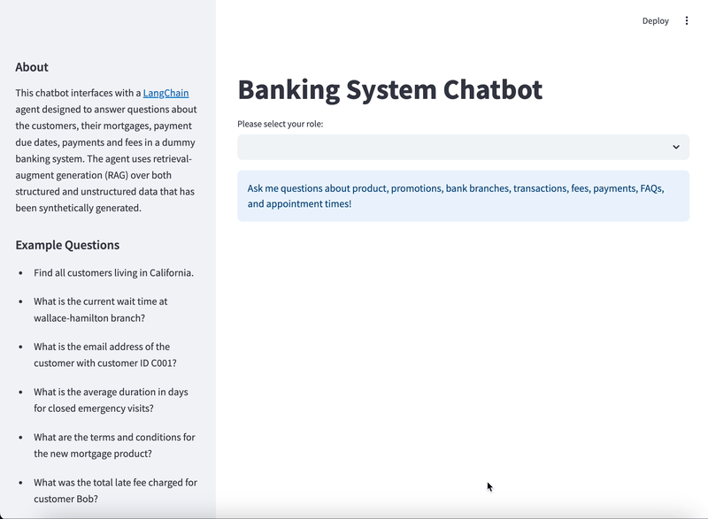

# Build an LLM RAG Chatbot With LangChain

This repo contains the source code for an LLM RAG Chatbot built with LangChain, originally created for the Real Python article [Build an LLM RAG Chatbot With LangChain](https://realpython.com/build-llm-rag-chatbot-with-langchain/#demo-a-llm-rag-chatbot-with-langchain-and-neo4j). The goal of this project is to iteratively develop a chatbot that leverages the latest techniques, libraries, and models in RAG and Generative AI. Ideally, this repo gives developers a template to build chatbots for their own data and use-cases.

 Currently, the chatbot performs RAG over a synthetic [Banking system dataset](https://realpython.com/build-llm-rag-chatbot-with-langchain/#explore-the-available-data) and supports the following features:

- **Tool calling**: The chatbot agent has access to multiple tools including LangChain chains for RAG and fake API calls.

- **RAG over unstructured data**: The chatbot can answer questions about customer experiences based on their reviews. Patient reviews are embedded using OpenAI embedding models and stored in a Neo4j vector index. Currently, the RAG over unstructured data is fairly bare-bones and doesn't implement any advanced RAG techniques.

- **RAG over structured data (Text-to-Cypher)**: The chatbot can answer questions about structured Banking system data stored in a Neo4j graph database. If the chatbot agent thinks it can respond to your input query by querying the Neo4j graph, it will try to generate and run a Cypher query and summarize the results.

- **Dynamic few-shot prompting**: When the chatbot needs to generate Cypher queries based on your input query, it retrieves semantically similar questions and their corresponding Cypher queries from a vector index and uses them as context in the Cypher generation prompt. This retrieval strategy helps the chatbot generate more accurate queries and keeps the prompt small by only including examples that are relevant to the current input query.

- **Cypher Example Self-Service Portal**: This is a Streamlit app where you can add example questions and their corresponding Cypher queries to the vector index used by the chatbot for dynamic few-shot prompting. If the chatbot generates an incorrect query for a question, and you know the correct query, you can use the self-service portal to upload the correct query to the example index.

- **Serving via FastAPI**: The chatbot agent is served as an asynchronous FastAPI endpoint.

## Getting Started

Create a `.env` file in the root directory and add the following environment variables:

```.env
NEO4J_URI=<YOUR_NEO4J_URI>
NEO4J_USERNAME=<YOUR_NEO4J_USERNAME>
NEO4J_PASSWORD=<YOUR_NEO4J_PASSWORD>

OPENAI_API_KEY=<YOUR_OPENAI_API_KEY>

BRANCHES_CSV_PATH=https://raw.githubusercontent.com/tauseef1234/Datasets/main/test.csv
MORTGAGE_CSV_PATH=https://raw.githubusercontent.com/tauseef1234/Datasets/main/mortgage.csv
CUSTOMER_CSV_PATH=https://raw.githubusercontent.com/tauseef1234/Datasets/main/customer.csv
FEES_CSV_PATH=https://raw.githubusercontent.com/tauseef1234/Datasets/main/fees.csv
FAQS_CSV_PATH=https://raw.githubusercontent.com/tauseef1234/Datasets/main/faqs.csv
PAYMENTS_MADE_CSV_PATH=https://raw.githubusercontent.com/tauseef1234/Datasets/main/payments.csv
PAYMENTS_DUE_CSV_PATH=https://raw.githubusercontent.com/tauseef1234/Datasets/main/payments_due.csv
EXAMPLE_CYPHER_CSV_PATH=https://raw.githubusercontent.com/tauseef1234/Datasets/main/example_cypher.csv

CHATBOT_URL=http://host.docker.internal:8000/bank-rag-agent

BANK_AGENT_MODEL=gpt-4o
BANK_CYPHER_MODEL=gpt-4o
BANK_QA_MODEL=gpt-4o

NEO4J_CYPHER_EXAMPLES_INDEX_NAME=questions
NEO4J_CYPHER_EXAMPLES_NODE_NAME=Question
NEO4J_CYPHER_EXAMPLES_TEXT_NODE_PROPERTY=question
NEO4J_CYPHER_EXAMPLES_METADATA_NAME=cypher
```

The three `NEO4J_` variables are used to connect to your Neo4j AuraDB instance. Follow the directions [here](https://neo4j.com/cloud/platform/aura-graph-database/?ref=docs-nav-get-started) to create a free instance.

The chatbot currently uses OpenAI LLMs, so you'll need to create an [OpenAI API key](https://realpython.com/generate-images-with-dalle-openai-api/#get-your-openai-api-key) and store it as `OPENAI_API_KEY`.

Once you have a running Neo4j instance, and have filled out all the environment variables in `.env`, you can run the entire project with [Docker Compose](https://docs.docker.com/compose/). You can install Docker Compose by following [these directions](https://docs.docker.com/compose/install/).

Once you've filled in all of the environment variables, set up a Neo4j AuraDB instance, and installed Docker Compose, open a terminal and run:

```console
$ docker-compose up --build
```

After each container finishes building, you'll be able to access the chatbot api at `http://localhost:8000/docs`, the Streamlit app at `http://localhost:8501/`, and the Cypher Example Self-Service Portal at `http://localhost:8502/`



## Supporting Articles

You can read the following articles for more detailed information on this project:

- [Build an LLM RAG Chatbot With LangChain](https://realpython.com/build-llm-rag-chatbot-with-langchain/#demo-a-llm-rag-chatbot-with-langchain-and-neo4j)
- [A Simple Strategy to Improve LLM Query Generation](https://towardsdatascience.com/a-simple-strategy-to-improve-llm-query-generation-3178a7426c6f)

## Future Additions

The plan for this project is to iteratively improve the Banking System Chatbot over time as new libraries, techniques, and models emerge in the RAG and Generative AI space. Here are a few features currently in the backlog:

- **Memory with Redis**
- **Hybrid structured and unstructured RAG**
- **Multi-modal RAG**
- **An email tool**
- **Data visualizations**
- **Stateful agents with LangGraph**
- **Terraform to provision cloud resources**
- **Chatbot performance evaluation and experiment tracking**
- **API authentication**
